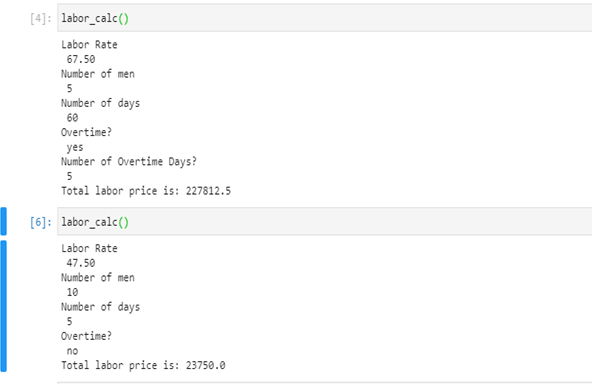
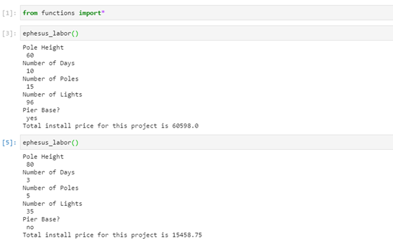

# work_stuff  
---
# The 'Projects' folder contains all the work completed in this repository

This repository is where I integrate my Python skills with my professional projects.  

Most of the notebooks are simple note taking, calculations, or documenting project materials.  

## functions.py  
---  
This .py file is where I have substantially increased my own productivity.  

#### Standard Labor Calculator
"labor_calc" takes user inputs to quickly and easily calculate how much capital will be spent on labor for a certain project.  
  

#### Complete Project Calculator - Sports Lighting Projects
"ephesus_labor" is essentially the same as labor_calc with a bit more complexity added in. This function can calculate the cost of the entire project, not just the labor. It's constructed using a base price for a number of different materials. These prices have been pin-pointed from many trial and error attempts as well as market and competitor research. Alongside these prices, user inputs are used to calculate labor cost, material cost, any sub-contractor cost, and has a few degrees of freedom embedded to ensure that the function works regardless of the scope of the specific project I am working on.   
